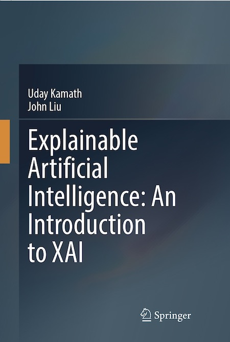

# Explainable Artificial Intelligence: An Introduction to XAI

## By Uday Kamath and John Chih Liu

The field of Explainable AI addresses one of the most significant shortcomings of machine learning and deep learning algorithms today: the interpretability of models. As algorithms become more powerful and make predictions with better accuracy, it becomes increasingly important to understand how and why a prediction is made. Without interpretability and explainability, it would be difficult for the users to trust the predictions of real-life applications of AI. 

This repository contains the case studies (data and code) and errata for the book Explainable Artificial Intelligence, An Introduction to XAI. It serves as:
- Single resource addressing the theory and practice of interpretability and explainability techniques using case studies
- Covers exploratory data analysis, feature importance, interpretable algorithms, and model agnostic techniques
- Includes over 220 color figures, tables and charts, and Git repos with data and Google colab notebooks for each chapter

The Springer Nature website for the book is: https://www.springer.com/us/book/9783030833558

The book can be purchased from Amazon at: https://www.amazon.com/MOXIC-Abstract-Rectangular-Children-Anti-Slip/dp/3030833550

 
## About This Book

This book takes an in-depth approach to presenting the fundamentals of interpretable and explainable AI through mathematical theory and practical use cases. The content is split into five parts: 1) pre-hoc techniques involving exploratory data analysis, visualization and feature engineering, 2) intrinsic and interpretable machine learning, 3) model-agnostic methods, 4) explainable deep learning methods and 5) A survey of interpretable and explainable methods applied to time series, natural language processing and computer vision.

The field of Explainable AI addresses one of the most significant shortcomings of machine learning and deep learning algorithms today: the interpretability of models. As algorithms become more powerful and make predictions with better accuracy, it becomes increasingly important to understand how and why a prediction is made. Without interpretability and explainability, it would be difficult for the users to trust the predictions of real-life applications of AI.

Explainable Artificial Intelligence: An Introduction to XAI offers its readers a collection of techniques and case studies that serves as an accessible introduction for those entering the field, and for current AI/ML researchers as they integrate explainability into their research and innovation.

# Who This Book Is For

This book is an ideal text for AI practitioners wishing to learn methods that enable them to interpret and explain model predictions. This book addresses a large market as the interpretability problem is significant in healthcare, finance, and many other industries. Current AI/ML researchers will also find this book helpful as they integrate explainability into their research and innovation.

# About the Authors

Uday Kamath has spent more than two decades developing analytics products in statistics, optimization, machine learning, NLP and speech recognition, and explainable AI. Uday has a Ph.D. in scalable machine learning and has contributed to many journals, conferences, and books in the field of AI. He is the author of books such as Deep Learning for NLP and Speech Recognition, Mastering Java Machine Learning, and Machine Learning: End-to-End Guide for Java Developers. He held many senior roles: Chief Analytics Officer for Digital Reasoning, Advisor for Falkonry, and Chief Data Scientist for BAE Systems Applied Intelligence. He has built products and solutions using AI in surveillance, compliance, cybersecurity, financial crime, anti-money laundering, and insurance fraud. Uday currently works as the Chief Analytics Officer for Smarsh. He is responsible for Data Science, research of analytics products employing deep learning and explainable AI, and modern techniques in speech and text used in the financial domain and healthcare.i

John Chih Liu, PhD, CFA is Chief Executive Officer of Intelluron Corporation. Previously, he held senior executive roles overseeing quantitative research, portfolio management and data science organizations, including as VP of Data Science, Applied Machine Learning at Digital Reasoning Systems, MD of Equity Strategies at the Vanderbilt University endowment, and Head of Index Options Trading at BNP Paribas. He is a frequent speaker and published author on topics including natural language processing, reinforcement learning, asset allocation, systemic risk and EM theory. John was named Nashville's Data Scientist of the Year in 2016, Finalist for Community Leader of the Year in 2018, and Finalist for Innovator of the Year in 2020. He earned his B.S., M.S., and Ph.D. in electrical engineering from the University of Pennsylvania and is a CFA Charterholder, advocate for the global data science community and supporter of the International Science and Engineering Fair.

